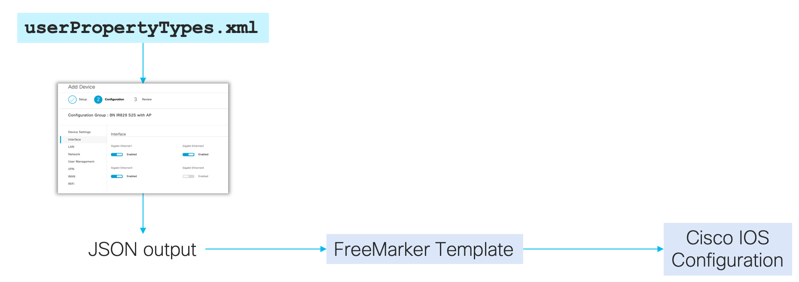

# eCVD-Templates

Contains eCVD templates for Cisco IoT Operations Center
This is the primary working location for members of the eCVD team.

It is based on the work that Mark Davison did:
https://github.com/mdavidson58/eCVD-Templates

# How it works

IoT OC will present the user with a graphical configuration template that is build based on `userPropertyTypes.xml`. Based on user input and preference, a data model is fed to the appropriate template that will generate an IOS configuration file.

# UPT

Written in XML with JSON payload. Make sure to validate full syntax is correct before moving to production with https://github.com/etychon/iotoc-userPropertyTypes-validator

# Templates

Written in [FreeMarker](https://freemarker.apache.org/)
